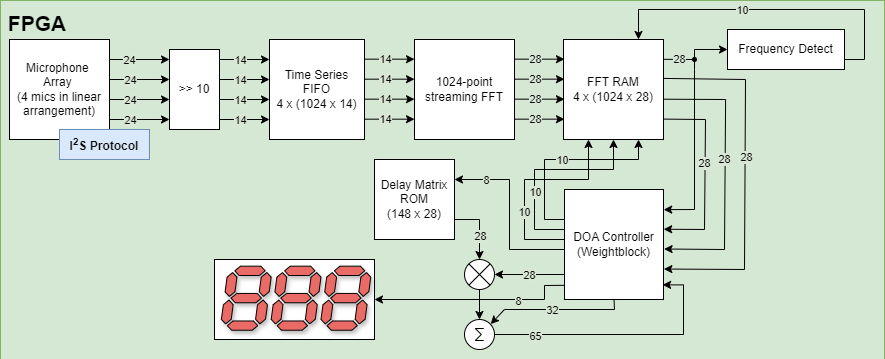
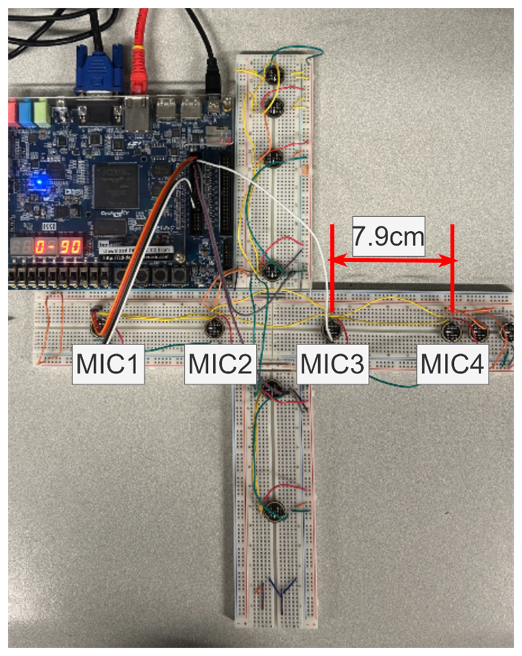

## Final version
### Important files: 
+ audio.sv (I2S Interface, Module Instantiations, and Avalon Bus)
+ fft\_wrapper.sv (FFT and FFT RAM instantiations)
+ freqdetect.sv (Find the max bin)
+ weightblock.sv (Bartlett Algorithm)
+ angdisplay.sv (Seven-segment displays controller)
### Contributors:
[Peter](https://github.com/PeterW-XD)

[Matheu](https://github.com/matheucampbell)

[Dawn](https://github.com/dawn-yoo)

### Introduction:
A powerful 2-D sound localizer by Bartlett method of beamforming on DE1-SOC platform. The direction of arrival shows on a seven-segment display.

### Figures:

